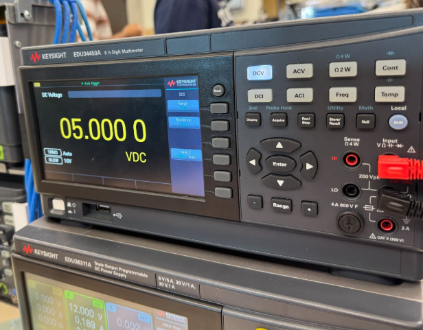
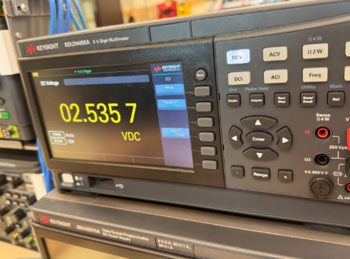

# Linear Voltage Regulator – Schematic Capture, Simulation, Assembly, and Validation


[](LICENSE)


> **TL;DR:**  
> End-to-end design, simulation, hardware assembly, and validation of a discrete linear voltage regulator. Recreated schematic, performed LTspice analysis, soldered PCB, and validated output using oscilloscope and DMM—mirroring industry hardware validation flow.

**Technologies:**  
LTspice · Schematic Capture (Altium Designer) · Analog Circuit Design · PCB Soldering · Oscilloscope & Multimeter Validation · Test Point Measurement · Simulation-to-Lab Correlation · Git

---

## Table of Contents

- [Block Diagram](#block-diagram)
- [Schematic & Simulation](#schematic--simulation)
- [PCB Assembly & Test Points](#pcb-assembly--test-points)
- [Lab Measurements & Validation](#lab-measurements--validation)
- [Key Design Decisions](#key-design-decisions)
- [How to Replicate](#how-to-replicate)
- [Supporting Materials](#supporting-materials)
- [What I Learned](#what-i-learned)
- [Contact](#contact)

---

## Block Diagram


<p align="center"><b>Figure 1:</b> Color-coded block diagram with explicit feedback and test point labeling. System flow, feedback, and measurement location are shown for hardware validation.</p>

---

## Schematic & Simulation

| LTspice Regulator Schematic       | LTspice Power Supply Schematic       |
|:---------------------------------:|:------------------------------------:|
|  |  |

<p align="center"><b>Figure 1:</b> Regulator circuit schematic in LTspice.<br>
<b>Figure 4:</b> Simulated power supply input schematic in LTspice.</p>

---

### **Simulation Waveforms**

| Output Simulation (5kΩ load)         | Regulator Output (after PSU)        |
|:------------------------------------:|:-----------------------------------:|
|  |  |

<p align="center"><b>Figure 5:</b> Output with 5000Ω load shows voltage instability (no continuous DC).<br>
<b>Figure 6:</b> Regulator output waveform after connecting to simulated power supply.</p>

---

| Input vs Output (Full System)            |
|:----------------------------------------:|
|  |

<p align="center"><b>Figure 7:</b> Input (rectified) vs output (regulated, 5V) voltages. Regulator maintains 5V during input peaks.</p>

---

## PCB Assembly & Test Points

- **Manually soldered PCB, used “hairpin” test points for easy probing.**
- **Test point for validation is clearly marked at output (VOUT, 5V).**

| Assembled PCB (Top View)              | Output Test Point (Scope/DMM)         |
|:-------------------------------------:|:-------------------------------------:|
|  |     |

<p align="center"><b>Figure 4:</b> Fully soldered linear regulator PCB.  
<b>Figure 5:</b> Output test point for oscilloscope and multimeter validation (VOUT, 5V).</p>

---

## Lab Measurements & Validation

### **Oscilloscope Results (Input & Output)**

- **Dual-channel scope confirms input and output behavior matches simulation.**
- **Output remains at 5V with Vin ≥ 6.5V; measured at test point.**

| Oscilloscope Dual-Channel (Input/Output)     | Output Vpp and RMS (Oscilloscope)         |
|:--------------------------------------------:|:-----------------------------------------:|
|     |   |

<p align="center"><b>Figure 6:</b> Input (yellow) and output (blue) scope traces—output is stable 5V when input is sufficient.  
<b>Figure 7:</b> Measured output Vpp and RMS—confirms low ripple and proper regulation.</p>

---

### **DMM Validation of Output Voltage**

- **Precision trimmer adjusted for exactly 5.00V at output.**

| Output at No Load (DMM)                  | Output at 33Ω Load (DMM)              |
|:----------------------------------------:|:--------------------------------------:|
|            |     |

<p align="center"><b>Figure 8:</b> Output set to 5.00V (no load).  
<b>Figure 9:</b> Output remains 5.00V under 33Ω load.</p>

---

### **Additional Measurements (Op-Amp, AC RMS, etc.)**

| Op-Amp Inverting Input (2.5V)           | Op-Amp Non-Inverting Input (2.5V)      |
|:---------------------------------------:|:--------------------------------------:|
| |   |

| AC RMS at Input (DMM)                   | AC RMS at Output (DMM)                 |
|:----------------------------------------:|:--------------------------------------:|
|     |  |

<p align="center"><b>Figures 10–13:</b> Validation of op-amp node voltages and AC RMS measurements for input and output.</p>

---

## Key Design Decisions

- **Schematic Ownership:**  
  Captured the schematic independently in Altium, ensuring understanding of each subsystem for simulation and validation.
- **Testability:**  
  Added accessible test points at VOUT for oscilloscope/DMM probes, mirroring “design for test” best practices.
- **Validation Workflow:**  
  Correlated simulation results with hardware, tuned for regulation, and documented performance under varied conditions.

---

## How to Replicate

1. **Clone this repo:**  
   ```bash
   git clone https://github.com/hyeonjijung1/linear-voltage-regulator-pcb.git
   cd linear-voltage-regulator-pcb
   ```

2. **Review the schematic and simulation files in `/hardware/` and `/docs/`.**

3. **Order or fabricate the PCB using the provided schematic and Gerbers, or build the circuit on a breadboard for prototyping.**

4. **Solder components as per the schematic, ensuring careful placement of test points for measurement and validation.**

5. **Power the board with a DC supply (e.g., 12V), connect a load resistor (e.g., 33Ω, 5W), and validate the output using a digital multimeter and oscilloscope.**

6. **Compare hardware measurements to simulation waveforms and DC operating points for full-cycle validation.**

---

## What I Learned

- **End-to-end hardware validation:** Developed hands-on skills from schematic capture and simulation to assembly and bench testing—mirroring real ASIC/hardware development.
- **Design for test:** Integrated explicit test points for validation and troubleshooting, enabling reliable, reproducible results.
- **Simulation vs. reality:** Practiced correlating LTspice simulations with physical hardware performance, deepening understanding of analog circuits and measurement techniques.
- **Technical communication:** Documented the workflow with clear visuals and reasoning, as expected in professional engineering teams.

---

## Contact

[](https://linkedin.com/in/hyeonjijung-uoft)

**Hyeonji Jung**  
junghyeonji254@gmail.com

---